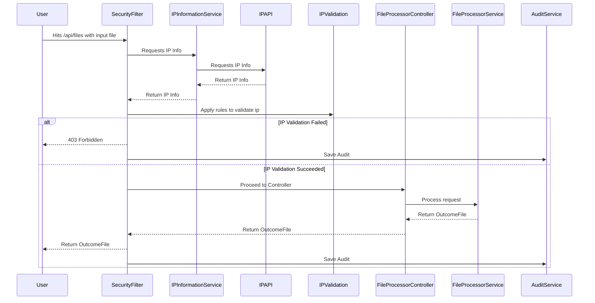

## File Processor

Develop a Restful system that accepts an input file of a specific format, process it and respond with output file.

<< New Branch to handle TODOs and FIXME >> And also upgrading the test stack.

### Contents

1. [Technology Stack](#technology-stack)
2. [Sequence Flow](#sequence-flow)
3. [Input file format](#input-file-format)
4. [Output file format](#output-file-format)
5. [API](#api)
6. [Database](#database)
7. [Testing locally](#testing-locally)
8. [Alternatives and things to do](#alternatives-and-things-to-do)

#### [Technology Stack](#technology-stack)
* Kotlin 1.8.x
* Spring Boot 3.2.x
* Reactor and Coroutines
* PostgresSQL
* Jdbc (Not using ORM or r2dbc for this task)
* Docker

#### [Sequence Flow](#sequence-flow)

Features are divided into 2 separate concerns 1. Security and 2. FileProcessing

Security Module will perform necessary IP validations and pass the baton to process the file. Once the processing of file is complete, it will be audited for security purposes.



#### [Input file format](#input-file-format)

* File format - txt
* Name - EntryFile.txt

| UUID                                 | ID     | Name          | Likes          | Transport       | Avg Speed | Top Speed |
|--------------------------------------|--------|---------------|----------------|-----------------|-----------|-----------|
| 18148426-89e1-11ee-b9d1-0242ac120002 | 1X1D14 | John Smith    | Likes Apricots | Rides A Bike    | 6.2       | 12.1      |
| 3ce2d17b-e66a-4c1e-bca3-40eb1c9222c7 | 2X2D24 | Mike Smith    | Likes Grape    | Drives an SUV   | 35.0      | 95.5      |
| 1afb6f5d-a7c2-4311-a92d-974f3180ff5e | 3X3D35 | Jenny Walters | Likes Avocados | Rides A Scooter | 8.5       | 15.3      |

#### [Output file format](#output-file-format)

* File format - json
* Name - OutcomeFile.json

| Name          | Transport       | Top Speed |
|---------------|-----------------|-----------|
| John Smith    | Rides A Bike    | 12.1      |
| Mike Smith    | Drives an SUV   | 95.5      |
| Jenny Walters | Rides A Scooter | 15.3      |

#### [API](#api)
* OpenAPI document can be accessed over [here](src/main/resources/openapi.yaml). 
* Following API first development. However, not using any sort of code generators for this task.


#### [Database](#database)
For every request for file processing, log the information in PostgresSQL.
1. Request id – This can be simply a generated UUID.
2. Request Uri
3. Request Timestamp – This should be the timestamp when the request reached the
   application
4. HTTP Response code – 200, 403 , 500 etc
5. Request IP Address
6. Request Country Code
7. Request IP Provider – The provider (ISP) of the IP address
8. Time Lapsed – The time taken (in milliseconds) to complete the request

#### [Acceptance Criteria](#acceptance-criteria)

#### [Testing locally](#testing-locally)

A [Makefile](Makefile) is included in the project root, which will start the application and its dependencies in clean state.
```shell
make dev build execute
```
To perform a quick test, refer [quicktests.http](quicktests.http) and place the [file.txt](file.txt) in an appropriate location.
* Forbidden scenario - Use IP 123.123.123.123
* Success scenario - Use IP 149.250.252.66

##### Acceptance criteria
```text
   GIVEN a file with valid entry file contents is uploaded
      AND from a valid ip
   WHEN POST /api/files is invoked
   THEN respond with 200 OK
      AND response contains valid OutcomeFile.json with expected json contents
      AND a security audit entry is persisted to assessment table
      
   GIVEN a file with valid entry file contents is uploaded
      AND from a invalid ip originating from a restricted country or datacenters
   WHEN POST /api/files is invoked
   THEN respond with 403 Forbidden
      AND a security audit entry is persisted to assessment table
   
   GIVEN a file with invalid entry file contents is uploaded
       AND from a valid ip
   WHEN POST /api/files is invoked
   THEN respond with 500 Internal Server Error  (TODO, this should be a BadRequest)
      AND a security audit entry is persisted to assessment table
```

#### [Alternatives and things to do](#alternatives-and-things-to-do)
* Integration tests to a separate source set
* Feature flag - Currently it is a simple implementation using configuration properties. 
* Global exception handler to handle text processing errors and respond with BadRequest instead of 500 Internal Server Error
* In case of any un expected errors in saving audit, the information should nt be lost and to be alerted.
* Improvements  in logging
