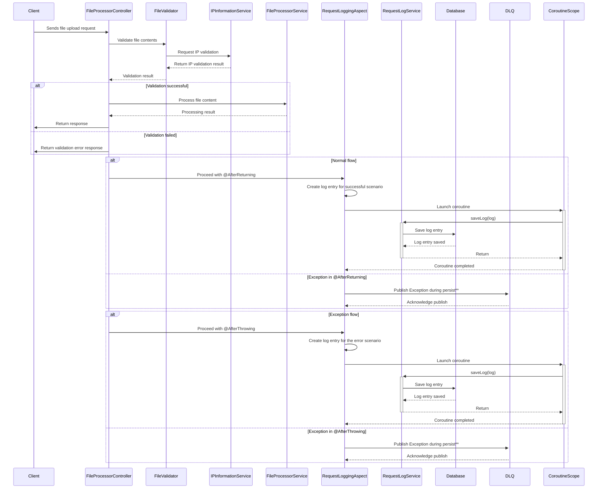

## File Processor

Develop a Restful system that accepts an input file of a specific format, process it and respond with output file.

### Contents

1. [Technology Stack](#technology-stack)
2. [Sequence Flow](#sequence-flow)
3. [Input file format](#input-file-format)
4. [Output file format](#output-file-format)
5. [API](#api)
6. [Database](#database)
7. [Acceptance Criteria](#acceptance-criteria)
8. [Alternatives and things to do](#alternatives-and-things-to-do)

#### [Technology Stack](#technology-stack)
* Kotlin 1.8.x
* Coroutines
* Spring Boot 3.2.x
* R2DBC
* PostgresSQL
* Jdbc (Not using ORM for this task)
* Docker

#### [Sequence Flow](#sequence-flow)

** DLQ mentioned in the sequence diagram is not an actual one, instead an in memory queue just to store the requests. Actual scenario will use a proper Queueing mechanism.

#### [Input file format](#input-file-format)

* File format - txt
* Name - EntryFile.txt

| UUID                                 | ID     | Name          | Likes          | Transport       | Avg Speed | Top Speed |
|--------------------------------------|--------|---------------|----------------|-----------------|-----------|-----------|
| 18148426-89e1-11ee-b9d1-0242ac120002 | 1X1D14 | John Smith    | Likes Apricots | Rides A Bike    | 6.2       | 12.1      |
| 3ce2d17b-e66a-4c1e-bca3-40eb1c9222c7 | 2X2D24 | Mike Smith    | Likes Grape    | Drives an SUV   | 35.0      | 95.5      |
| 1afb6f5d-a7c2-4311-a92d-974f3180ff5e | 3X3D35 | Jenny Walters | Likes Avocados | Rides A Scooter | 8.5       | 15.3      |

#### [Output file format](#output-file-format)

* File format - json
* Name - OutcomeFile.json

| Name          | Transport       | Top Speed |
|---------------|-----------------|-----------|
| John Smith    | Rides A Bike    | 12.1      |
| Mike Smith    | Drives an SUV   | 95.5      |
| Jenny Walters | Rides A Scooter | 15.3      |

#### [API](#api)
* OpenAPI document can be accessed over [here](src/main/resources/openapi.yaml). 
* Following API first development. However, not using any sort of code generators for this task.

#### [Database](#database)
For every request for file processing, log the information in PostgresSQL.
1. Request id – This can be simply a generated UUID.
2. Request Uri
3. Request Timestamp – This should be the timestamp when the request reached the
   application
4. HTTP Response code – 200, 403 , 500 etc
5. Request IP Address
6. Request Country Code
7. Request IP Provider – The provider (ISP) of the IP address
8. Time Lapsed – The time taken (in milliseconds) to complete the request

#### [Acceptance Criteria](#acceptance-criteria)

#### [Alternatives and things to do](#alternatives-and-things-to-do)
* Flyway migration
* Idempotency of requests